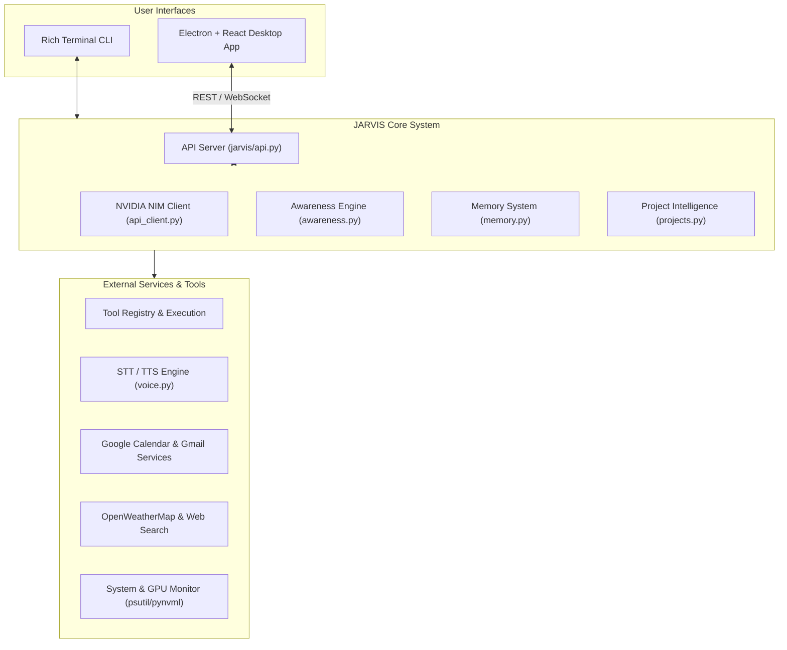

# JARVIS - Autonomous AI Assistant & Intelligence System

[](https://www.python.org/)
[](https://www.electronjs.org/)
[](https://reactjs.org/)
[](https://build.nvidia.com/)
[](LICENSE)

An Iron-Man-inspired, dual-interface (Desktop GUI + Terminal CLI) AI assistant packed with real-time proactive system awareness, voice synthesis, autonomous tool execution, project intelligence, and Google Workspace integrations.

---

## ✨ Features at a Glance

### 🧠 Advanced Multi-Model AI Engine
- **NVIDIA NIM API Integration**: Powered by state-of-the-art LLMs including `meta/llama-3.1-405b-instruct`, `70b`, `8b`, `mistralai/mistral-large`, and `google/gemma-7b`.
- **Streaming & Dynamic Fallback**: Real-time token streaming with automatic fallback strategies for maximum reliability.

### 🖥️ Dual Modern Interfaces
- **Electron + React Desktop GUI**: Sleek visual interface featuring glassmorphic controls, dark mode aesthetic, animated status monitors, and WebSocket communication.
- **Rich Terminal CLI**: Interactive CLI rendered with panels, custom color themes, boot animations, command history, and dynamic live spinners.

### 🎙️ Full Voice Interaction Subsystem
- **Offline Speech-to-Text (STT)**: Fast, local transcription powered by `faster-whisper`.
- **Dual Text-to-Speech (TTS)**: Online high-definition natural voice synthesis via `edge-tts` (e.g. Iron-Man British voice `en-GB-RyanNeural`) with offline fallback via `pyttsx3`.
- **Push-to-Talk & Streaming Speech**: Hold spacebar for hands-free audio recording with instant speech playback.

### ⚡ Autonomous Tool Execution
- **File System & Shell Tools**: Read/write files, create directories, run system shell commands, inspect search paths.
- **Application Control**: Launch system applications (`apps.py`) and perform desktop workflows.
- **Safety First**: Configurable confirmation prompts for potentially destructive commands with complete command audit logs (`jarvis_commands.log`).

### 👁️ Proactive System & Workspace Awareness
- **Resource Monitoring**: Real-time tracking of CPU, RAM, Disk space, Network I/O, and NVIDIA GPU metrics via `psutil` and `pynvml`.
- **Proactive Alerts & Boot Greetings**: Intelligent system state notifications (disk pressure, battery, memory load) and dynamic context-aware greetings.

### 📁 Project & Code Intelligence
- **Codebase Indexing**: Automated project context injection, workspace structure parsing, and git status tracking.
- **Self-Learning Project Memory**: Remembers past architectural decisions, pending tasks, and repository-specific patterns.

### 📅 Integrations & Services
- **Google Workspace**: Google Calendar (`calendar_service.py`) and Gmail (`email_service.py`) with seamless OAuth2 authentication (`google_auth.py`).
- **Weather Forecasting**: Live OpenWeatherMap data with location-based alerts (`weather.py`).
- **Web Search**: Real-time DuckDuckGo web searching for up-to-date information.

### 🛡️ Trust & Diagnostics
- **Self-Diagnostics (`/diagnose`)**: On-demand system self-test verifying API access, voice engines, memory storage, and environment health.
- **Action Reasoning (`/why`)**: Explains the logic behind JARVIS's recent actions and decisions.
- **Confidence-Flagged Outputs**: Indicates response confidence levels for critical operations.

---

## 🏗️ Architecture Overview



---

## 🚀 Quick Start

### Prerequisites
- **Python**: Version `3.8` or higher
- **Node.js**: Version `18` or higher (required for Desktop GUI)
- **NVIDIA NIM API Key**: Free API key from [build.nvidia.com](https://build.nvidia.com/)

### 1. Clone & Virtual Environment Setup

```bash
# Clone repository
git clone https://github.com/nivedjkr/jarvis-assistant.git
cd jarvis-assistant

# Create virtual environment
python -m venv venv

# Activate virtual environment
# On Windows:
venv\Scripts\activate
# On Linux/macOS:
source venv/bin/activate
```

### 2. Install Python Dependencies

```bash
pip install -r requirements.txt
```

### 3. Configure Environment Variables

Copy `.env.example` to `.env` and fill in your keys:

```bash
cp .env.example .env
```

Edit `.env`:
```env
NVIDIA_NIM_API_KEY=your_nvidia_nim_api_key
OPENWEATHER_API_KEY=your_openweather_api_key  # Optional
```

---

## 💻 Running JARVIS

### Option A: Terminal CLI Mode

Run the rich interactive terminal interface:

```bash
python -m jarvis.cli
```

### Option B: Desktop GUI Mode

1. **Start the API Server Backend**:
   ```bash
   python jarvis/api.py
   ```

2. **Launch the Desktop Application**:
   ```bash
   cd jarvis-desktop
   npm install
   npm run dev
   ```

---

## 🎮 Command Cheat Sheet

### ⌨️ Terminal Slash Commands

| Command | Description |
| :--- | :--- |
| `/help [category]` | View categorized help and command documentation |
| `/clear` | Clear terminal output |
| `/history` | Show session conversation history |
| `/tools` | List all available autonomous tools |
| `/reminders` | View scheduled reminders |
| `/notes` | View saved notes |
| `/tasks` | View recent task history |
| `/voice on/off` | Enable or disable interactive voice mode |
| `/diagnose` | Run full system self-diagnostic checks |
| `/why` | Display rationale for JARVIS's latest action |
| `/exit` | Gracefully exit JARVIS |

### 🗣️ Voice Mode Controls

- **Enable**: Type `/voice on` in CLI.
- **Record**: Hold down **Spacebar** while speaking.
- **Send**: Release **Spacebar** to transcribe and execute.
- **Disable**: Type `/voice off`.

---

## ⚙️ Configuration Reference

Customize your experience in `config.yaml`:

```yaml
api:
  base_url: "https://integrate.api.nvidia.com/v1"
  model: "meta/llama-3.1-405b-instruct"
  temperature: 0.7
  max_tokens: 1000
  stream: true

memory:
  file: "jarvis_memory.json"
  log_file: "jarvis_commands.log"

tools:
  confirm_dangerous: true
  log_commands: true

voice:
  enabled: false
  stt_model: "base"           # "base" or "small" for faster-whisper
  tts_engine: "edge"           # "edge" (online) or "pyttsx3" (offline)
  tts_voice: "en-GB-RyanNeural"# Natural British accent
  push_to_talk_key: "space"
  auto_stop_recording: true

location:
  city: "Kerala"
  country: "India"
```

---

## 🔌 Integrations Setup Guide

### 1. Google Workspace (Calendar & Gmail)
1. Navigate to [Google Cloud Console](https://console.cloud.google.com/).
2. Enable **Google Calendar API** and **Gmail API**.
3. Download OAuth 2.0 Client credentials file as `credentials.json` and place it in `jarvis/data/credentials.json`.
4. Upon executing calendar/email features, OAuth authorization will prompt in your browser and save token state automatically.

### 2. OpenWeatherMap
1. Obtain an API key from [openweathermap.org](https://openweathermap.org/api).
2. Set `OPENWEATHER_API_KEY` in `.env`.
3. Set your preferred city/country in `config.yaml`.

### 3. GPU Monitoring
- Real-time GPU stats utilize `pynvml` / `nvidia-smi`.
- Non-NVIDIA or integrated graphics systems automatically fallback cleanly without warnings.

---

## 📂 Repository Structure

```
JARVIS/
├── jarvis/                     # Python Core Subsystem
│   ├── api.py                  # REST & WebSocket API Server
│   ├── api_client.py           # NVIDIA NIM API Client
│   ├── apps.py                 # System Application Manager
│   ├── awareness.py            # Proactive Context & Alert Engine
│   ├── calendar_service.py     # Google Calendar Integration
│   ├── cli.py                  # Rich Terminal Interface
│   ├── email_service.py        # Gmail OAuth Integration
│   ├── google_auth.py          # Unified OAuth Handler
│   ├── memory.py               # Long-Term Storage & Logs
│   ├── projects.py             # Project & Codebase Intelligence
│   ├── system_monitor.py       # CPU / RAM / Disk / GPU Monitoring
│   ├── tools.py                # Autonomous Tool Engine
│   ├── ui.py                   # Terminal Styling & Panels
│   ├── voice.py                # STT & TTS Voice Engine
│   └── weather.py              # OpenWeatherMap Integration
├── jarvis-desktop/             # Electron + React GUI
│   ├── electron/               # Electron Main Process
│   ├── src/                    # React Components & CSS
│   └── package.json            # Desktop Node Dependencies
├── config.yaml                 # System Configuration
├── requirements.txt            # Python Dependencies
├── .env.example               # Environment Variables Template
└── README.md                  # Project Documentation
```

---

## 🛡️ Safety & Auditing

- **Command Safety Rules**: Dangerous shell commands require explicit confirmation prior to execution.
- **Audit Trails**: Every command execution is timestamped and logged to `jarvis_commands.log`.
- **Isolated Credentials**: Sensitive tokens are preserved in local ignored storage (`jarvis/data/`).

---

## 🤝 Contributing

Contributions are greatly appreciated! Feel free to open issues or submit pull requests.

1. Fork the Project
2. Create your Feature Branch (`git checkout -b feature/AmazingFeature`)
3. Commit your Changes (`git commit -m 'Add some AmazingFeature'`)
4. Push to the Branch (`git push origin feature/AmazingFeature`)
5. Open a Pull Request

---

## 📄 License

Distributed under the **MIT License**. See `LICENSE` for more information.

---

<p align="center">
  <b>Built with ❤️ using NVIDIA NIM API</b>
</p>
